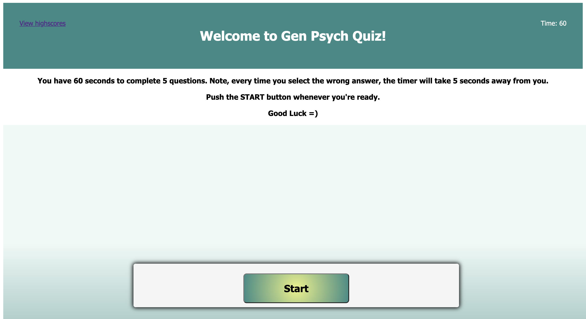

# Quiz

## Description 
This is a General Psychology Quiz. It consist of five multiple-choice questions.

This app runs in the browser and features dynamically updated HTML and CSS powered by JavaScript code. It has a clean, polished, and responsive user interface.

The user can expect instructions on the home page of the application. After the game is over, the app allows you to save your score along with initials.

## Demo

This application can be found here:
* https://alenareh.github.io/quiz/

The URL of the GitHub repository that contains the code of the application:
* https://github.com/AlenaReh/quiz

## Contributors

- Alena Rehberger <https://github.com/AlenaReh>

​
## Credits

Thanks to w3schools <https://w3schools.com> and Trilogy Education Services for providing all of the necessery tools for building this application.

